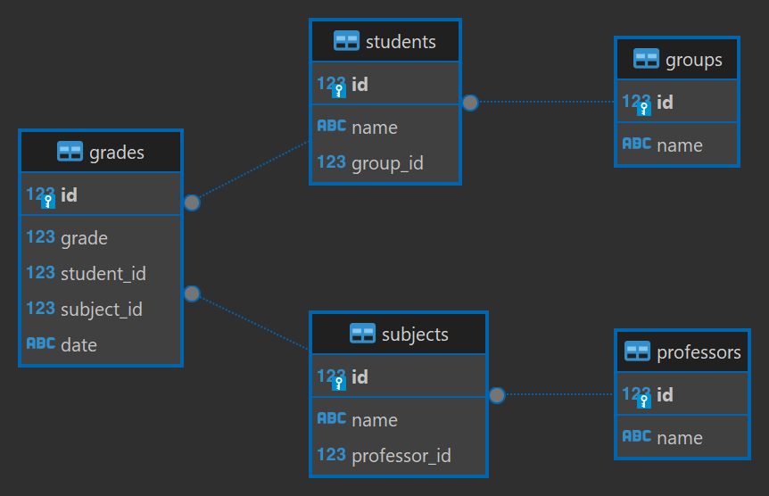

# Database Management Tool

This Python application manages a SQLite database containing student, professor, subject, and grade data for a school. It provides functions to create, populate, query, and interact with the database.

## Features

- **Database creation and table management:**
    - Creates SQLite database file `db.sqlite3` with the following tables:
        - `groups`
        - `students`
        - `professors`
        - `subjects`
        - `grades`
    - Establishes appropriate foreign key relationships between tables.
  
- **Test data generation:**
    - Inserts randomly generated student, professor, subject, and grade data into the tables.
- **Data retrieval and display:**
    - Retrieves and displays data from all tables.
- **SQL script execution:**
    - Executes all SQL files located in the `SQL` subdirectory, allowing for more complex queries and analysis.

## Usage

1. Clone this repository.
2. Install Python 3.
3. Run the main script: `python manage_db.py`
4. Follow the interactive prompts to perform database actions.

## Available Commands

- **c**: Create database tables.
- **d**: Drop all database tables.
- **i**: Insert test data into tables.
- **s**: Show data from all tables.
- **q**: Execute all SQL files in the `SQL` subdirectory.
- **h**: Display this help menu.
- **x**: Exit the application.

## Additional Notes

- The `constants.py` file contains various constants used throughout the application, such as database file name, SQL queries, and sample data.
- The `SQL` directory is intended for storing SQL files with specific queries or tasks.
